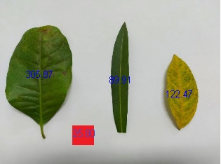

# area-foliar
Diagnose em area foliar - Em construção

# Determinacao de área foliar 

remove(list=ls())
setwd("C:/R/img/folha")
library(EBImage)
im=readImage("folha_teste.jpg")      #Minha image a ser testada
plot(im)
ref=readImage("referencia.jpg")      #Quadrado vermelho 25 cm²
plot(ref)
fundo=readImage("fundo.jpg")         # recorte com o fundo branco
plot(fundo)
folhas=readImage("compilado_cores_folhas.jpg")  #Compilado com as cores das folhas
plot(folhas)

# Transformando os vetores em uma matriz de referência - cor vermelha
mref=cbind(c(ref@.Data[,,1]),c(ref@.Data[,,2]),c(ref@.Data[,,3]))
mref=mref[sample(1:nrow(mref)),]
mref=mref[1:50000,]
colnames(mref)=c("R","G","B")

# Transformando em uma matriz de referência - cor de fundo
mfundo=cbind(c(fundo@.Data[,,1]),c(fundo@.Data[,,2]),c(fundo@.Data[,,3]))
mfundo=mfundo[sample(1:nrow(mfundo)),]
mfundo=mfundo[1:20000,]
colnames(mfundo)=c("R","G","B")

# Transformando em uma matriz de referência - cor de fundo
mfolhas=cbind(c(folhas@.Data[,,1]),c(folhas@.Data[,,2]),c(folhas@.Data[,,3]))
mfolhas=mfolhas[sample(1:nrow(mfolhas)),]
mfolhas=mfolhas[1:50000,]
colnames(mfolhas)=c("R","G","B")

# Matriz contendo os dados do undo, folhas e referencia efetuados
mat1=rbind(cbind(mfundo,1),cbind(mfolhas,0),cbind(mref,0))
colnames(mat1)[4]="Y"
mat1=data.frame(mat1)

#Aplicando a função glm linear
modelo1=glm(Y~R+G+B,data=mat1,family = binomial("logit"))

# Agora utilar o modelo para predizer o objeto im - a imagem inicial
mim=cbind(c(im@.Data[,,1]),c(im@.Data[,,2]),c(im@.Data[,,3]))
colnames(mim)=c("R","G","B")

# Passa para data Frame 
mim=data.frame(mim)
pred1=predict(modelo1,newdata = mim,type="response")
pred1=round(pred1,0)

MPred1=matrix(pred1,ncol=ncol(im@.Data[,,1]))
im2=im
im2@.Data=MPred1

# exibir imagem com fundo separado das folhas
plot(im2)

#Agora criar matriz para separar folha do quadrado de referencia
mat2=rbind(cbind(mfolhas,0),cbind(mref,1))
colnames(mat2)=c("R","G","B","Y")
mat2=data.frame(mat2)

modelo2=glm(Y~R+G+B,family = binomial("logit"),data=mat2)
ID=MPred1==0

# matriz com valores R G B dos objetos
Mat3=cbind(cbind(im@.Data[,,1][ID]),cbind(im@.Data[,,2][ID]),cbind(im@.Data[,,3][ID]))
colnames(Mat3)=c("R","G","B")
Mat3=data.frame(Mat3)
pred2=predict(modelo2,newdata = Mat3,type="response")
pred2=round(pred2,0)

NumPixelRef=sum(pred2==1)

MPred1b=bwlabel(MPred1==0)
Shape=computeFeatures.shape(MPred1b)
ID2=Shape[,1]>1000
Area=Shape[ID2,1]
AreaCor=Area*46.75/NumPixelRef

Coord=computeFeatures.moment(MPred1b)
Coord=Coord[ID2,]

# plota a imagem com a área foliar
plot(im)
text(Coord[,1],Coord[,2],round(AreaCor,2),col="blue",cex=0.8)

